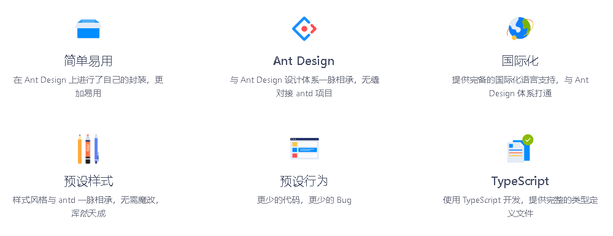

# ProComponents
https://procomponents.ant.design/

ProComponents 是为了降低在中后台实现 CRUD 的成本而研发，其思路是减少必要的状态维护，更专注于业务。

Use Ant Design like a Pro!

##布局
###ProLayout - 高级布局
* ProLayout 可以提供一个标准又不失灵活的中后台标准布局，同时提供一键切换布局形态，自动生成菜单等功能。与 PageContainer 配合使用可以自动生成面包屑，页面标题，并且提供低成本方案接入页脚工具栏。
* 页面中需要承载内容时，可以使用 ProLayout 来减少布局成本。

###PageContainer - 页容器
* PageContainer 是为了减少繁杂的面包屑配置和标题，很多页面都需要面包屑和标题的配置。当然也可以关掉自动生成的，而使用自己的配置。
* PageContainer 封装了 antd 的 PageHeader 组件，增加了 tabList 和 content。 根据当前的路由填入 title 和 breadcrumb。它依赖 Layout 的 route 属性。当然你可以传入参数来复写默认值。 PageContainer 支持 Tabs 和 PageHeader 的所有属性。

###ProCard - 标准卡片
* 页内容器卡片，提供标准卡片样式，卡片切分以及栅格布局能力。

##数据录入
###ProForm - 高级表单
* ProForm 在原来的 Form 的基础上增加一些语法糖和更多的布局设置，帮助我们快速的开发一个表单。同时添加一些默认行为，让我们的表单默认好用。
* 分步表单，Modal 表单，Drawer 表单，查询表单，轻量筛选等多种 layout 可以覆盖大部分的使用场景，脱离复杂而且繁琐的表单布局工作，更少的代码完成更多的功能。

##数据展示
###ProTable - 高级表格
* ProTable 的诞生是为了解决项目中需要写很多 table 的样板代码的问题，所以在其中做了封装了很多常用的逻辑。这些封装可以简单的分类为预设行为与预设逻辑。
* 依托于 ProForm 的能力，ProForm 拥有多种形态，可以切换查询表单类型，设置变形成为一个简单的 Form 表单，执行新建等功能。
* 当你的表格需要与服务端进行交互或者需要多种单元格样式时，ProTable 是不二选择。

###EditableProTable - 可编辑表格
* 可编辑表格 EditableProTable 与 ProTable 的功能基本相同，为了方便使用 EditableProTable 增加了一些预设，关掉了查询表单和操作栏，同时修改了 value 和 onChange 使其可以方便的继承到 antd 的 Form 中。

###ProList - 高级列表
* 基于 ProTable 实现，可以认为是 ProTable 的一个特例，在完成一个标准的列表时即可使用。

###ProDescriptions - 高级定义列表
* 高级描述列表组件，提供一个更加方便快速的方案来构建描述列表。
* ProDescriptions 的诞生是为了解决项目中需要写很多 Descriptions 的样板代码的问题，所以在其中做了封装了很多常用的逻辑。在 React 中写一个 Descriptions 免不了需要定义一些雷同的属性。所以 ProDescriptions 默认封装了请求网络，columns 列展示的逻辑。
* 比如 ProDescriptions 封装了请求网络的行为，ProDescriptions 会将 props.params 中的数据默认带入到请求中，如果接口恰好与我们的定义相同，实现一个查询会非常简单。

##通用
###ProSkeleton - 骨架屏
* 该组件为内部组件，请勿直接使用。
* 页面级别的骨架屏，不支持自定义

###ProField - 原子组件
* 该组件为内部组件，请勿直接使用。
* 原子信息组件，统一 ProForm、ProTable、ProList、Filter 等组件里面的字段定义。

